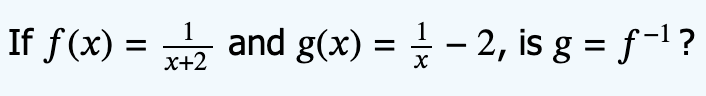
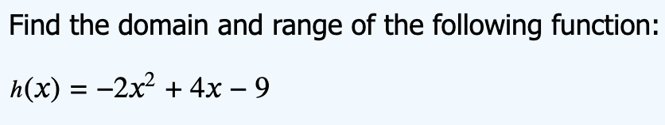
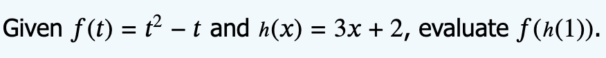

# Week 1 - DM Homework Report
### 1.1 Problem:

#### Solution:To solve this task we need to know the definition of a function. A *Function* assigns exactly one output to each input, otherwise it's not a function: 


### 1.2 Problem:

#### Solution: To solve this task we need to know the definition of a surjective function. A *Surjective Function* has at least one input associated with each output, meaning that for each output there should be one or more input. 


### 1.3 Problem:

#### Solution: To solve this task we need to know the definition of a injective function. A *Surjective Function* produces one output associated with one input. The answers for this question is the same as (# 1.2)

### 1.4 Problem:

#### Solution: To solve this task we need to know the inverse function and how to find it.


### 1.5 Problem:

#### Solution: 


### 1.6 Problem:

#### Solution: 


### 1.7 Problem:

#### Solution:


### 1.8 Problem:

#### Solution: 
```bash
    Domain: For any quadratic function, it is (-∞, ∞).
    Range:
        - Find the vertex (h, k). h = -b/2a, k = f(-b/2a)
        - If a > 0, range is [k, ∞).
        - If a < 0, range is (-∞, k].
```


### 1.9 Problem:

#### Solution: To solve this task we need to know the zeroes of the denominator, domain can be any real number except the zeroes.


### 1.10 Problem:

#### Solution: To solve this task we need to know 


### 1.11 Problem:

#### Solution: To solve this task we need to know the formula to find the slope using two points.


### 1.12 Problem:

#### Solution: To solve this task we need to know that slope m = deltaY/deltaX or m = rise/run. So we need to move the starting point to rise on OY and to run on OX. In this case we will move point (1,-1) 3 units up and 4 units to the right.


### 1.13 Problem:

#### Solution: 


### 1.14 Problem:

#### Solution: 


### 1.15 Problem:

#### Solution: 


### 1.16 Problem:

#### Solution: 


### 1.17 Problem:

#### Solution: 


### 1.18 Problem:

#### Solution: 


### 1.19 Problem:

#### Solution: To solve this task we need to know that  f(x) = f(-x) - even function, f(-x)= -f(x) - odd function.


### 1.20 Problem:

#### Solution: 


### 1.21 Problem:

#### Solution: To solve this task we need to know


### 1.22 Problem:


#### Solution: 


### 1.23 Problem:

#### Solution: 


### 1.24 Problem:


#### Solution: Absolute maxima is f(2)=f(-2) = 16, absolute minima f(3) = -10.

### 1.25 Problem:


#### Solution: Local maxima is f(1)= 2, local minima f(-1) = -2.

### 1.26 Problem:

#### Solution: To solve this task we need to know the condition when lines either are parallel or perpendicular. The slopes of *parallel lines* are equal, m1=m2. Two lines are *perpendicular* when m1*m2 = -1. So f(x) and j(x) are *parallel lines*, h(x) and g(x) are *perpendicular lines* .

### 1.27 Problem:

#### Solution: 


### 1.28 Problem:

#### Solution: 


### 1.29 Problem:


#### Solution: 


### 1.30 Problem:


#### Solution: 


### 1.31 Problem:


#### Solution: 


### 1.32 Problem:

#### Solution: 


### 1.33 Problem:

#### Solution: 


### 1.34 Problem:

#### Solution: 


### 1.35 Problem:

#### Solution: 


### 1.36 Problem:

#### Solution: 


### 1.37 Problem:

#### Solution: 
