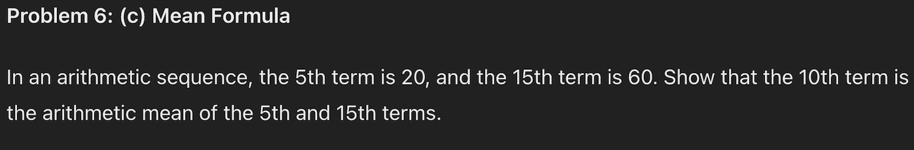
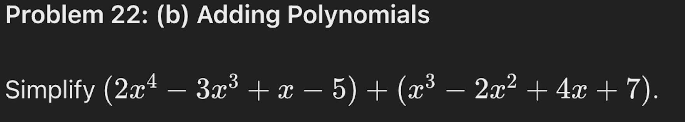
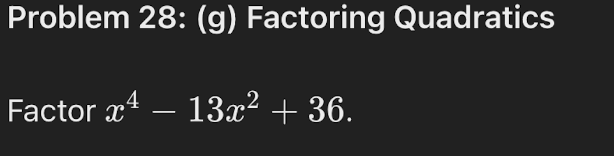

# Week 2 - DM Homework Report
### 2.1 Problem:

#### Solution: 

### 2.2 Problem:

#### Solution: 

### 2.3 Problem:

#### Solution: 

### 2.4 Problem:

#### Solution: 

### 2.5 Problem:

#### Solution: 

### 2.6 Problem:

#### Solution: 

### 2.7 Problem:

#### Solution: 

### 2.8 Problem:

#### Solution: 

### 2.9 Problem:

#### Solution: 

### 2.10 Problem:

#### Solution: 

### 2.11 Problem:

#### Solution: 

### 2.12 Problem:

#### Solution: 

### 2.13 Problem:

#### Solution: 

### 2.14 Problem:

#### Solution: 

### 2.15 Problem:

#### Solution: 

### 2.16 Problem:

#### Solution: 

### 2.17 Problem:

#### Solution: 

### 2.18 Problem:

#### Solution: 

### 2.19 Problem:

#### Solution: 

### 2.20 Problem:

#### Solution: 