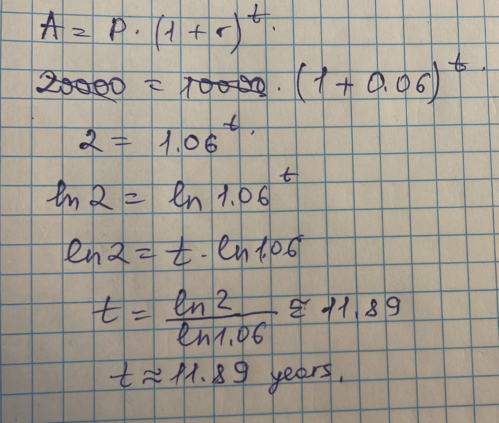
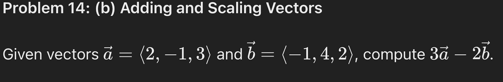

# Week 3 - DM Homework Report
### 3.1 Problem:

#### Solution: 

### 3.2 Problem:

#### Solution: 

### 3.3 Problem:

#### Solution: 

### 3.4 Problem:

#### Solution: 

### 3.5 Problem:

#### Solution: 

### 3.6 Problem:

#### Solution: 

### 3.7 Problem:

#### Solution: 

### 3.8 Problem:

#### Solution: 

### 3.9 Problem:

#### Solution: 

### 3.10 Problem:

#### Solution: 

### 3.11 Problem:

#### Solution: 

### 3.12 Problem:

#### Solution: 

### 3.13 Problem:

#### Solution:  This polynomial is 5th degree with 4 terms.

### 3.14 Problem:

#### Solution: 

### 3.15 Problem:

#### Solution: 

